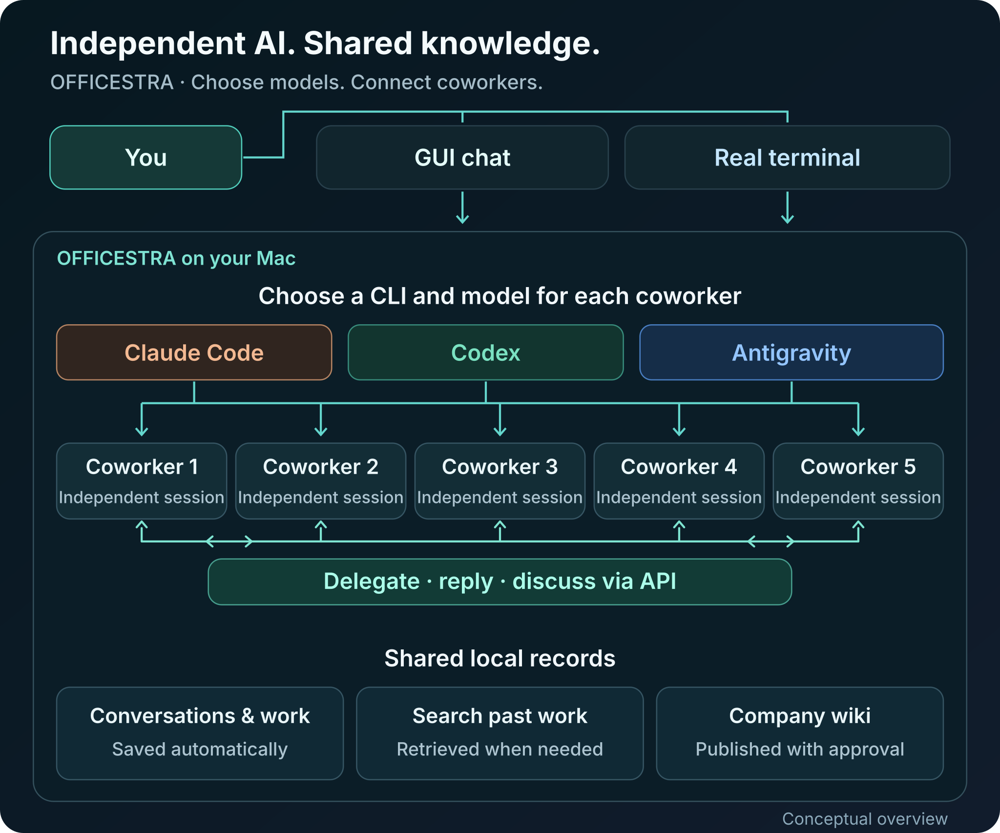
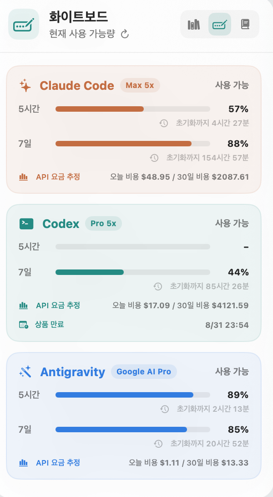
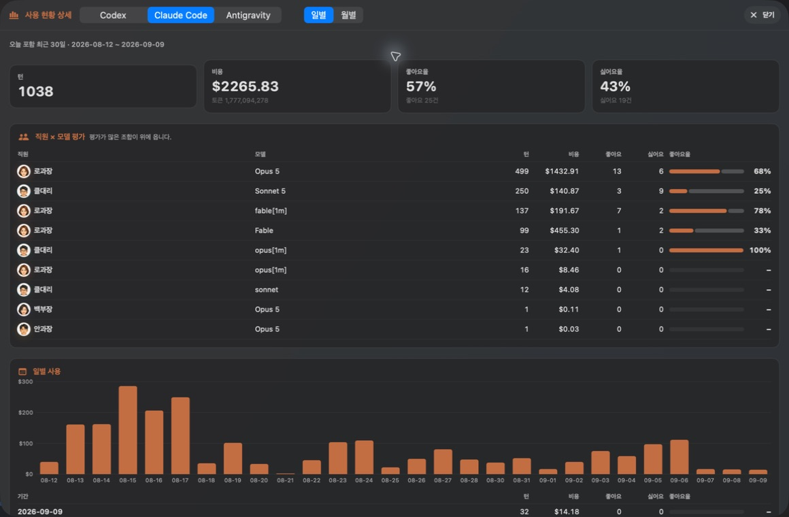

# OFFICESTRA

[한국어](README.md) | **English**

> **Independent AI sessions. One team.**

Run Claude Code, Codex, and Antigravity together in one macOS app.<br>
**Five independent sessions · Coworker collaboration · English / Korean**

<p align="center">
  
</p>

## GUI or real terminal — your choice

<table>
  <tr>
    <td width="50%" align="center">
      <a href="docs/images/officestra-gui-mode.png"></a><br>
      <strong>GUI mode</strong><br>
      <sub>See conversations and work in progress</sub>
    </td>
    <td width="50%" align="center">
      <a href="docs/images/officestra-terminal-mode.png"></a><br>
      <strong>Terminal mode</strong><br>
      <sub>Work directly in a coworker's CLI</sub>
    </td>
  </tr>
</table>

Continue a coworker's session in the terminal, then return to the GUI to review the work.<br>
*Original app screenshots. Click to view full size. Screenshots show the Korean interface; the app also supports English.*

## Work independently. Collaborate as a team.

Split work across coworkers. A lead AI can delegate and consolidate the results,
while coworkers exchange requests, replies, and reviews through the API.
**Each conversation session stays independent.**

<p align="center">
  <a href="docs/images/officestra-architecture-en.svg"></a>
</p>

Conversations and work records stay local. Search past work when needed,
and publish knowledge to the company wiki with your approval.

## New models arrive automatically. You choose.

<p align="center">
  <a href="docs/images/officestra-gui-mode.png"></a>
</p>

Choose a different CLI, model, reasoning level, and role for each coworker.
Supported models and reasoning options refresh automatically.
In **model visibility settings**, hide only the models you do not want.<br>
*A detail cropped from the original GUI screenshot, without rescaling its pixels.*

## See which AI is ready for the next task

<p align="center">
  <a href="docs/images/officestra-gui-mode.png"></a>
</p>

Check provider limits and reset times before assigning the next task.
Review work activity, answers, and costs in conversations, and find past records when needed.<br>
*A detail from the original whiteboard screenshot. Amounts are API-equivalent costs, not subscription charges.*

## Compare costs and work ratings

<p align="center">
  <a href="docs/images/officestra-statistics.jpg"></a>
</p>

See when costs rise and which coworker–model combinations earn better feedback, all in one view.<br>
*Actual Claude Code statistics. Displayed amounts are not subscription charges.*

Models, reasoning options, and usage information depend on your account and CLI version.
This README describes features on the current `main` branch.

## Get started

The **v1.4.0** DMG does not include some later additions. For the latest features, use the AI-assisted source setup below.

### Easiest path: ask an AI to do it

Send the following request to Codex, Claude Code, or Antigravity if you already
use one of them:

> “Download `https://github.com/neosp8888-design/officestra.git` to this Mac and run
> OFFICESTRA. Preserve my existing AI CLI logins and projects, inspect the
> environment first, and install only missing dependencies. Verify that both the
> app and its local backend are running.”

### Download the app

[Download OFFICESTRA v1.4.0 DMG](https://github.com/neosp8888-design/officestra/releases/tag/v1.4.0)
— Apple silicon · macOS 14 or later · English/Korean.

Open the DMG and drag OFFICESTRA into Applications. Node.js is included. You still
need Docker Desktop and the AI CLIs you want to use, installed and signed in.

> This is a **Community Preview** without Apple notarization. If macOS blocks
> launch, verify the download's source, then use **Open Anyway** for this app in
> System Settings → Privacy & Security. Preserve your existing conversations and
> work records when updating.

<details>
<summary><strong>Manual installation — for experienced users</strong></summary>

### 1. Requirements

- An Apple silicon Mac running macOS 14 or later
- Xcode Command Line Tools with Git and Swift 6.0 or later
- Node.js 20 or later and npm
- Docker Desktop
- At least one signed-in Codex, Claude Code, or Antigravity CLI

Install Apple's command-line developer tools.

```sh
xcode-select --install
```

If [Homebrew](https://brew.sh/) is available, install Node.js and Docker Desktop,
then launch Docker.

```sh
brew install node
brew install --cask docker
open -a Docker
```

### 2. Install and sign in to an AI CLI

You do not need all three. Install only the CLIs you plan to use, then launch
each one once to sign in to its service. Run only the command blocks you need.

**OpenAI Codex CLI** — [official guide](https://developers.openai.com/codex/cli/)

```sh
curl -fsSL https://chatgpt.com/codex/install.sh | sh
codex
```

**Anthropic Claude Code** — [official guide](https://code.claude.com/docs/en/getting-started)

```sh
curl -fsSL https://claude.ai/install.sh | bash
claude
```

**Google Antigravity CLI** — [official guide](https://codelabs.developers.google.com/antigravity-cli-hands-on)

```sh
curl -fsSL https://antigravity.google/cli/install.sh | bash
agy
```

If Docker installation fails, see the
[official Docker Desktop guide](https://docs.docker.com/desktop/setup/install/mac-install/).

### 3. Download the repository

```sh
git clone https://github.com/neosp8888-design/officestra.git "$HOME/OFFICESTRA"
cd "$HOME/OFFICESTRA"
```

If that location already contains an installation, inspect it first instead of
overwriting or deleting it.

### 4. Start the backend and app

Start the local database and backend in the first Terminal window.

```sh
cd "$HOME/OFFICESTRA"
./scripts/start-backend.sh
```

The first run may take a while while Docker images and packages download. When
it is ready, start the app from a second Terminal window.

```sh
cd "$HOME/OFFICESTRA"
swift run OfficeLLM
```

When the app opens, use the first-run assistant to select a workspace and assign
your signed-in CLIs to coworkers.

</details>

> [!WARNING]
> OFFICESTRA is still a preview. Back up important work. Check conversations and
> work records for sensitive information before sharing them.

[License](LICENSE)
