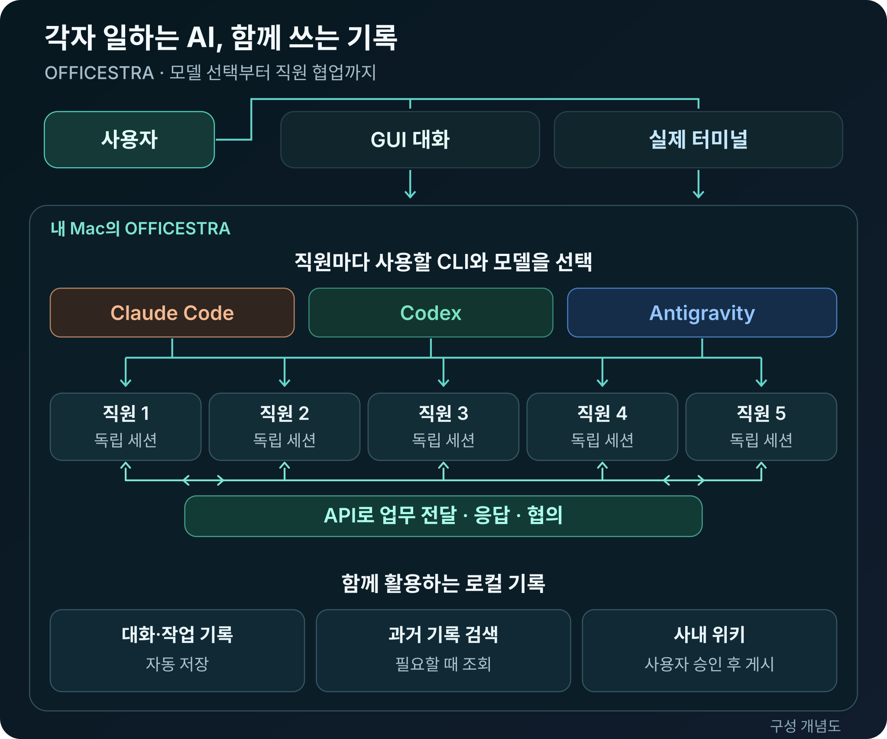

# OFFICESTRA

**한국어** | [English](README.en.md)

> **서로 다른 AI 세션을, 하나의 팀처럼.**

Claude Code · Codex · Antigravity를 한 화면에서 운영하는 macOS 앱입니다.<br>
**다섯 독립 세션 · 직원 간 협업 · 영어 / 한국어**

<p align="center">
  
</p>

## GUI와 실제 터미널, 원하는 방식으로

<table>
  <tr>
    <td width="50%" align="center">
      <a href="docs/images/officestra-gui-mode.png"></a><br>
      <strong>GUI 모드</strong><br>
      <sub>대화와 작업 진행을 한눈에</sub>
    </td>
    <td width="50%" align="center">
      <a href="docs/images/officestra-terminal-mode.png"></a><br>
      <strong>터미널 모드</strong><br>
      <sub>직원의 실제 CLI를 직접 조작</sub>
    </td>
  </tr>
</table>

직원의 세션을 이어서 터미널로 열고, GUI로 돌아와 작업 기록을 확인하세요.<br>
*두 화면은 실제 사용 원본입니다. 이미지를 누르면 크게 볼 수 있습니다.*

## 각자 일하고, 서로 답하고, 함께 마무리

여러 직원에게 일을 나눠 맡기세요. 대표 직원이 업무를 배분하고 결과를 취합하며,
직원끼리 API로 요청·응답·검토를 주고받을 수 있습니다. **각자의 대화 세션은 독립적으로 유지됩니다.**

<p align="center">
  <a href="docs/images/officestra-architecture-ko.svg"></a>
</p>

대화·작업 기록은 로컬에 저장하고, 과거 기록은 필요할 때 검색합니다.
사내 위키에는 사용자가 승인한 지식을 남깁니다.

## 직원이 서로 잘 일하게 만드는 업무 지침

직원 대화 하단의 **설정**에서 이름과 **업무 지침**을 직원별로 정할 수 있습니다.
각자 전문 분야와 담당 파일을 다르게 두되, 협업 규칙은 공통으로 넣는 편이 좋습니다.
아래 예시는 1,200자 제한 안에서 그대로 붙여 넣거나 역할에 맞게 고쳐 쓸 수 있습니다.

```text
업무를 시작하기 전에 목표·범위·금지사항을 확인한다.
다른 직원이 더 잘할 수 있는 독립 작업은 POST /api/agent-jobs로 한 번에 하나씩 위임한다. characterId는 수신 직원, senderCharacterId는 자신의 ID로 지정하고, 요청 본문에 목표·담당 파일·금지사항·회신 받을 characterId를 적는다.
직원에게 받은 요청은 단순 접수로 끝내지 말고 결과·검증·남은 위험을 원 발신자에게 새 턴으로 회신한다. 같은 파일을 동시에 수정하지 않고, 409(바쁨)에는 무한 재시도하지 않는다.
최종 담당자는 다른 직원의 답을 사실로 가정하지 말고 소스와 테스트로 확인한 뒤 하나의 결론으로 정리한다.
삭제·배포·재시작·권한 확대처럼 되돌리기 어려운 작업은 사용자 허가가 있을 때만 한다.
```

OFFICESTRA는 실행 시 각 직원에게 자신의 정확한 `senderCharacterId` 사용법을 자동으로
덧붙입니다. 이 값은 말풍선의 발신자 표시용이며 권한 증명이 아닙니다. 회신이 필요한
요청에는 **회신 대상 직원 ID**도 본문에 명시해야 하며, 접수 확인만 주고받는 무한
대화 대신 실제 결과가 생겼을 때 한 번 회신하는 방식을 권장합니다.

## 새 모델은 자동으로, 선택은 내 마음대로

<p align="center">
  <a href="docs/images/officestra-gui-mode.png"></a>
</p>

직원마다 CLI·모델·추론 수준·역할을 다르게 선택하세요.
지원 모델과 추론 옵션은 자동 갱신되고, **표시 모델 관리**에서는 쓰지 않을 모델만 제외합니다.<br>
*기존 GUI 원본의 직원 선택·퀵설정 영역을 잘라낸 확대 화면입니다.*

## 로컬 모델은 실험 기능입니다

로컬 AI는 자동 감지되는 일반 모델 옵션이 아니라, 운영자가 검증된 프로필을 먼저
등록하고 활성화해야 나타나는 **선택형 실험 기능**입니다. 클라우드 CLI가 기본 경로이며,
로컬 모델이 없어도 OFFICESTRA의 나머지 기능을 모두 사용할 수 있습니다.

### 로컬 모델이 없을 때

- 사용할 Codex·Claude Code·Antigravity CLI만 설치하고 로그인합니다.
- 직원의 빠른 설정 바에서 CLI와 클라우드 모델을 선택합니다.
- 로컬 프로필은 만들지 않아도 됩니다. 활성 프로필이 없으면 **로컬 AI** 메뉴도
  표시되지 않으며 추가 설정은 필요하지 않습니다.

### 준비된 로컬 모델이 있을 때

- 현재 공개 프리뷰에서 검증된 직접 실행 경로는 **Codex 실행기 + Responses 브리지 +
  SSH 호스트 키가 고정된 Windows NVIDIA PC + Qwen3.8-27B 64K(q8 KV)** 조합으로
  제한됩니다. 임의의 OpenAI 호환 URL을 붙이는 범용 설정 화면은 아직 아닙니다.
- 로컬 PC에는 저장소가 고정한 모델 파일과 런타임을 별도로 준비하고, Mac에는 해당
  PC에 비대화식으로 접속할 SSH 키와 호스트 키를 등록해야 합니다. 모델·런타임·경로·
  GPU 구성이 달라지면 프로필과 안전 기준을 다시 검증해야 합니다.
- 운영자가 로컬 백엔드에 유효한 프로필을 등록하고 활성화하면 직원의 CLI 메뉴에
  **로컬 AI**가 나타납니다. 진행 중인 작업을 끝내고 터미널을 닫은 다음 선택하세요.
- 전환하면 기존 대화 기록은 보존되지만 새 세션으로 시작합니다. 직원 **설정**에서
  로컬 PC의 IPv4 주소를 확인·저장할 수 있고, **이전 클라우드 설정으로 돌아가기**를
  선택하면 전환 전 CLI·모델·권한으로 복원됩니다.

OFFICESTRA는 자신이 시작한 로컬 프로세스만 관리하며, 다른 GPU 작업이나 기존 모델
서버가 실행 중이면 사용을 거부합니다. 로컬 턴에는 API 비용을 표시하지 않지만 전기·
장비 비용은 집계하지 않습니다. 이 릴리스에는 범용 원클릭 프로필 생성기가 없으므로,
새 하드웨어를 연결하려면 먼저 코드의 프로필 검증 조건을 확인하세요.

## 다음 일을 맡길 AI도 한눈에

<p align="center">
  <a href="docs/images/officestra-gui-mode.png"></a>
</p>

프로바이더별 사용 한도와 초기화 시각을 보고 다음 일을 맡기세요.
대화에서는 작업 내역·답변·비용을 확인하고, 필요한 기록은 다시 찾아볼 수 있습니다.<br>
*기존 GUI 원본의 화이트보드 확대 화면입니다. 표시 금액은 구독 청구액이 아닌 API 환산 비용입니다.*

## 비용과 작업 평가를 통계로

<p align="center">
  <a href="docs/images/officestra-statistics.jpg"></a>
</p>

비용이 언제 늘었는지, 어떤 직원·모델의 답변이 좋았는지 한 화면에서 비교하세요.<br>
*Claude Code의 실제 통계 화면입니다. 표시 금액은 구독 청구액이 아닙니다.*

모델·추론 옵션과 한도 정보는 계정 및 CLI 버전에 따라 달라집니다.
이 README는 현재 `main`의 기능을 소개합니다.

## 시작하기

최신 배포 DMG는 **v1.5.0**입니다. 소스에서 실행하려면 아래 AI 설치 요청을 사용하세요.

### 가장 쉬운 방법: AI에게 맡기기

이미 사용 중인 Codex, Claude Code 또는 Antigravity에 아래 문장을 그대로 보내세요.

> “`https://github.com/neosp8888-design/officestra.git`을 이 Mac에 내려받고 OFFICESTRA를
> 실행해줘. 기존 AI CLI 로그인과 프로젝트는 건드리지 말고, 먼저 환경을 확인한 뒤 빠진
> 의존성만 설치해. 앱과 로컬 백엔드가 정상 실행되는 것까지 확인해줘.”

### 앱으로 내려받기

[OFFICESTRA v1.5.0 DMG 다운로드](https://github.com/neosp8888-design/officestra/releases/tag/v1.5.0)
— Apple silicon · macOS 14 이상 · 영문/한글.

DMG를 열고 OFFICESTRA를 응용 프로그램 폴더로 옮기세요. Node.js는 앱에 포함되어
있으며, Docker Desktop과 사용할 AI CLI의 설치·로그인은 별도로 필요합니다.

> 이 배포본은 Apple 공증을 받지 않은 **Community Preview**입니다. macOS가 실행을
> 차단하면 출처를 확인한 뒤 시스템 설정 → 개인정보 보호 및 보안에서 해당 앱의
> **그래도 열기**를 선택하세요. 기존 설치의 대화·작업 기록은 지우지 마세요.

<details>
<summary><strong>직접 설치하기 — 숙련자용</strong></summary>

### 1. 준비할 것

- Apple silicon Mac과 macOS 14 이상
- Git과 Swift 6.0 이상을 포함한 Xcode Command Line Tools
- Node.js 20 이상과 npm
- Docker Desktop
- Codex, Claude Code, Antigravity 중 로그인된 CLI 하나 이상

Apple 개발 도구를 설치합니다.

```sh
xcode-select --install
```

[Homebrew](https://brew.sh/)가 준비돼 있다면 Node.js와 Docker Desktop을 설치하고
Docker를 실행합니다.

```sh
brew install node
brew install --cask docker
open -a Docker
```

### 2. 사용할 AI CLI 설치와 로그인

세 가지를 모두 설치할 필요는 없습니다. 사용할 CLI만 설치하고, 처음 실행할 때 각
서비스 계정으로 로그인하세요. 아래 명령 묶음 중 필요한 것만 실행합니다.

**OpenAI Codex CLI** — [공식 안내](https://developers.openai.com/codex/cli/)

```sh
curl -fsSL https://chatgpt.com/codex/install.sh | sh
codex
```

**Anthropic Claude Code** — [공식 안내](https://code.claude.com/docs/en/getting-started)

```sh
curl -fsSL https://claude.ai/install.sh | bash
claude
```

**Google Antigravity CLI** — [공식 안내](https://codelabs.developers.google.com/antigravity-cli-hands-on)

```sh
curl -fsSL https://antigravity.google/cli/install.sh | bash
agy
```

Docker 설치에 문제가 있으면 [Docker Desktop 공식 안내](https://docs.docker.com/desktop/setup/install/mac-install/)를
확인하세요.

### 3. 저장소 내려받기

```sh
git clone https://github.com/neosp8888-design/officestra.git "$HOME/OFFICESTRA"
cd "$HOME/OFFICESTRA"
```

같은 위치에 기존 설치가 있다면 덮어쓰거나 지우지 말고 먼저 상태를 확인하세요.

### 4. 백엔드와 앱 실행

첫 번째 터미널에서 로컬 데이터베이스와 백엔드를 시작합니다.

```sh
cd "$HOME/OFFICESTRA"
./scripts/start-backend.sh
```

첫 실행은 Docker 이미지와 패키지를 받아 시간이 걸릴 수 있습니다. 준비가 끝나면 두 번째
터미널에서 앱을 실행합니다.

```sh
cd "$HOME/OFFICESTRA"
swift run OfficeLLM
```

앱이 열리면 첫 실행 도우미에서 작업 폴더를 선택하고, 로그인해 둔 CLI를 직원에게
배정하면 됩니다.

</details>

> [!WARNING]
> OFFICESTRA는 아직 프리뷰입니다. 중요한 작업은 백업과 함께 진행하세요. 대화와 작업
> 기록을 외부에 공유하기 전에는 민감한 정보가 없는지 확인하세요.

[License](LICENSE)
